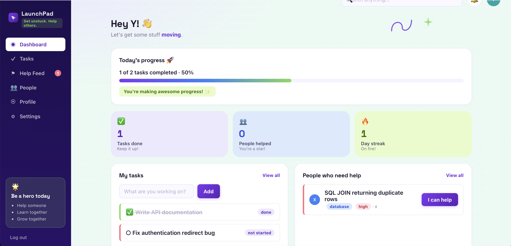
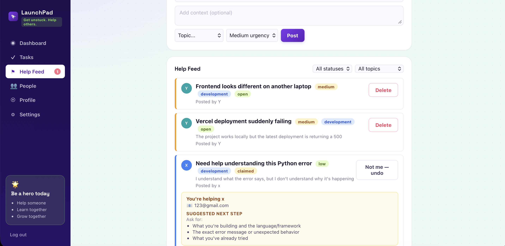
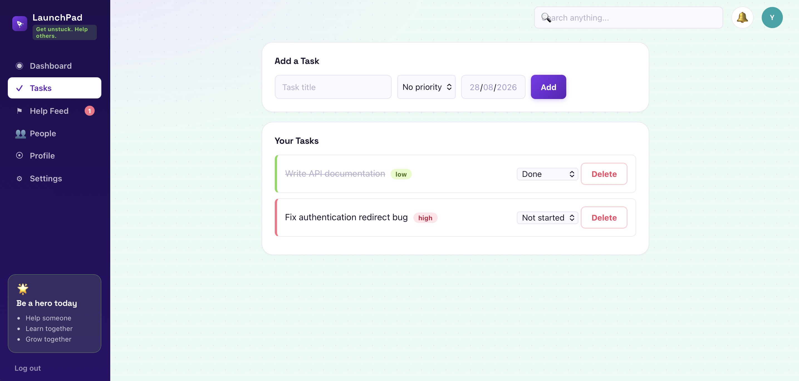

# LaunchPad

A lightweight internal tool for teams to track their own tasks and ask each other for help — built around one question: *when someone's stuck, how do they actually get unstuck?*

LaunchPad connects everyday task tracking with peer-to-peer help. A teammate can post what they're stuck on, another teammate can claim it, and both sides get the contact information and practical next steps needed to actually start solving the problem.

## Screenshots

### Dashboard

### Help Feed

### Tasks

## Why

Individual task trackers are common. What's less common is connecting "I'm stuck" to "here's exactly what you should do next."

LaunchPad tries to close that gap.

When a help request gets claimed, the app connects the two people with:
- the other person's contact information
- a topic-specific checklist of what to share or ask for
- a clear claim → help → resolve workflow

The goal isn't to solve the problem inside LaunchPad. It's to make it easier for the right people to find each other and start solving it.

## Features

- **Authentication** — session-based signup, login and logout
- **Tasks** — create tasks, update status, set priority and due dates, delete tasks
- **Dashboard** — today's task progress, task counts, recent help activity and activity history
- **Help Feed** — post requests with topic and urgency, claim and resolve requests, and filter by status and topic
- **One-claimer workflow** — prevents multiple people from claiming the same request
- **User isolation** — users can only access and modify their own protected resources
- **Contact & next steps** — once a request is claimed, both people see the other's email plus a topic-specific checklist
- **Profile** — task statistics, people-helped statistics and a chronological activity log
- **People & search** — discover other users and find relevant help requests
- **Responsive UI** — designed to remain usable across desktop and smaller screens

## Tech Stack

- **Backend:** Flask, Flask-SQLAlchemy, SQLite
- **Frontend:** Jinja templates, vanilla JavaScript (fetch), CSS
- **Authentication:** Flask sessions + Werkzeug password hashing
- **Architecture:** Flask Blueprints separated by feature

## Architecture

The application is organized around feature-specific blueprints. Routes for authentication, tasks, help requests, dashboard aggregation, profiles, people, search, settings and notifications are separated by responsibility rather than being placed in one large route file.

Dashboard and profile statistics are computed from the underlying Task and HelpRequest data instead of being stored as independent counters. This keeps derived values consistent when the underlying records change.

ActivityLog is maintained separately as an append-only history so the application can preserve a chronological record of meaningful user actions.

## Security

The API was manually tested end-to-end with real multi-user scenarios, including:
- unauthenticated requests being rejected
- validation of task and help-request input
- users being isolated from each other's tasks
- self-claiming being blocked
- double-claiming being rejected
- only the request poster being allowed to resolve a request
- already-resolved requests being protected from repeated resolution

Resources belonging to another user return 404 where appropriate rather than exposing whether the resource exists.

## Running Locally

python3 -m venv venv
source venv/bin/activate
pip install -r requirements.txt
cp .env.example .env
python app.py

Then visit http://127.0.0.1:5000/login.

By default the app generates a random `SECRET_KEY` on each restart, which is
fine for local development but will log everyone out whenever the server
restarts. To keep sessions stable, set a fixed `SECRET_KEY` in `.env`
(generate one with `python -c "import secrets; print(secrets.token_hex(32))"`).
A `SECRET_KEY` is required if `FLASK_ENV=production`.

## Future Scope

- Multiple claimers or a queue for high-demand requests
- Notifications when a request is claimed or resolved
- Team- or project-level grouping instead of a single flat feed
- Optional integrations with communication tools such as Teams or Slack
- In-app communication for longer help conversations
